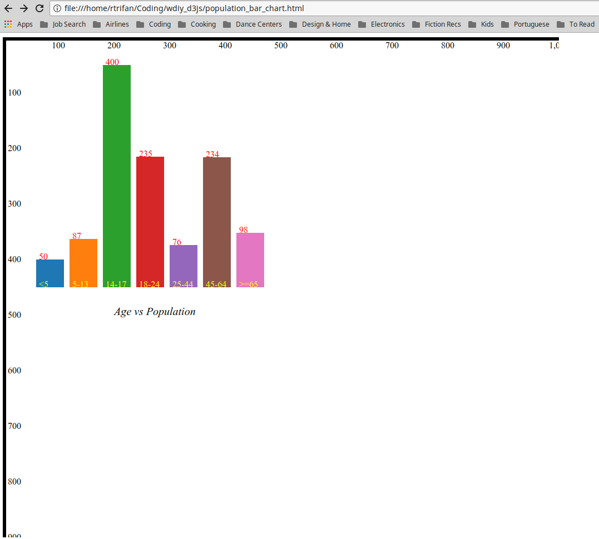
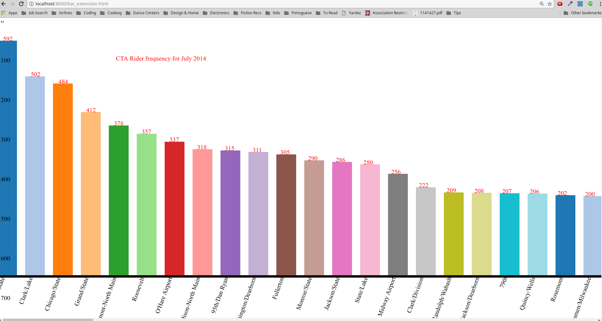

Women's Develop It Yourself - D3js library.

Chart in population_bar_chart.html can be viewed by opening the file in the browser.

Charts in bar_extension.html and weather_chart.html can be viewed by starting a Python server: 

python -m SimpleHTTPServer 8000

Snapsots of the charts built:

